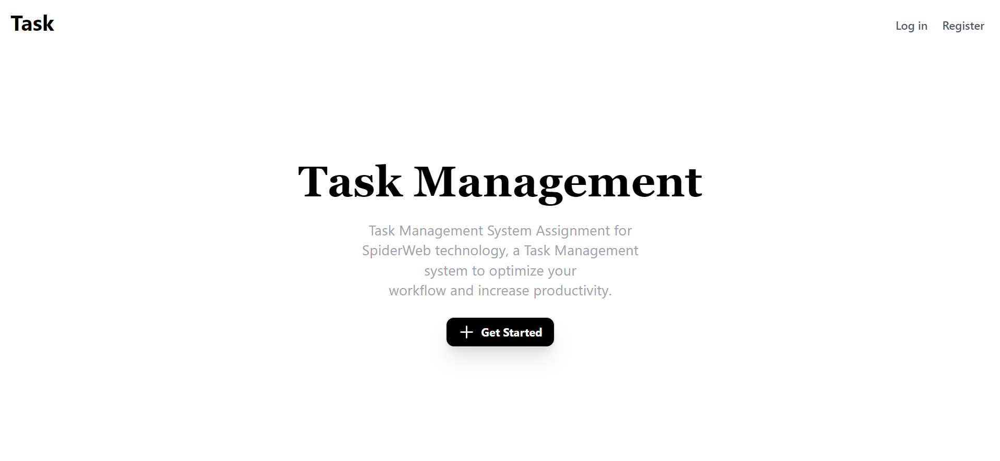
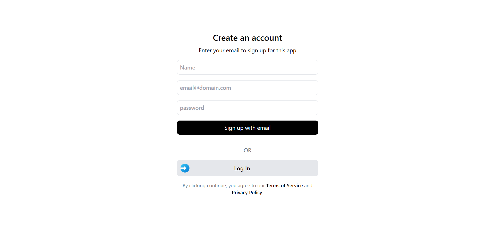
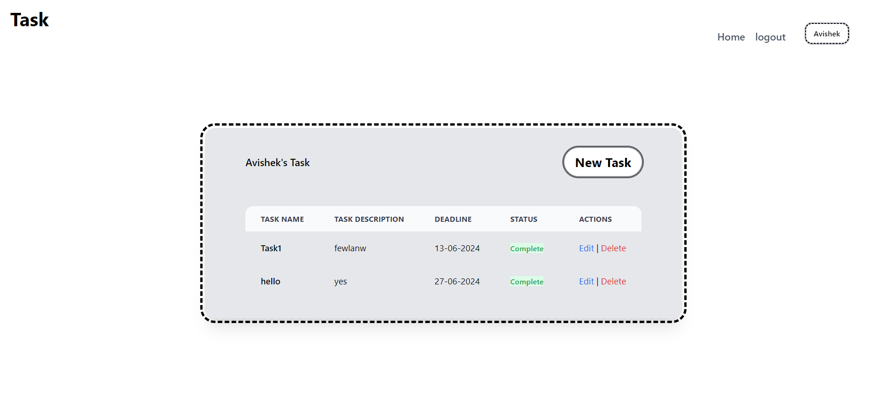

Sure, here's an updated README file reflecting those details:

---

# Task Management System

## Introduction

The Task Management System is a web application designed to help users manage and organize their tasks efficiently. The system provides features for user authentication and task management with deadlines.






## Features

- **Custom User Authentication**: Secure user registration and login.
- **Task Management**: Create, edit, delete, and view tasks.
- **Deadline Management**: Assign and track task deadlines.

## Technologies Used

- **Frontend**: HTML, Tailwind CSS
- **Backend**: Laravel
- **Database**: MySQL

## Installation

### Prerequisites

Ensure you have the following installed:

- PHP
- Composer
- MySQL

### Frontend Setup

1. Clone the repository:
    ```sh
    git clone https://github.com/avishek999/Task_Mangement_system.git
    ```
2. Navigate to the project directory:
    ```sh
    cd Task_Mangement_system
    ```
3. Manually include Tailwind CSS in your HTML files.

### Backend Setup

    ```
1. Install backend dependencies:
    ```sh
    composer install
    ```
2. Create a copy of the `.env` file:
    ```sh
    cp .env.example .env
    ```
3. Generate an application key:
    ```sh
    php artisan key:generate
    ```
4. Configure your `.env` file with your database credentials:
    ```env
    DB_CONNECTION=mysql
    DB_HOST=127.0.0.1
    DB_PORT=3306
    DB_DATABASE=your_database
    DB_USERNAME=your_username
    DB_PASSWORD=your_password
    ```
6. Run the database migrations:
    ```sh
    php artisan migrate
    ```

### Running the Application

1. Start the Laravel development server:
    ```sh
    php artisan serve
    ```
2. Your application should be running at `http://localhost:8000`.

## Usage

1. Register a new account or log in with existing credentials.
2. Create a new task by providing a title, description, and deadline.
3. View, edit, or delete existing tasks.

## Contributing

Contributions are welcome! Please fork the repository and submit a pull request for any changes.

## License

This project is licensed under the MIT License. See the [LICENSE](LICENSE) file for details.

## Contact

If you have any questions or feedback, please feel free to contact me at avishekprasad0999@gmail.com.

---

